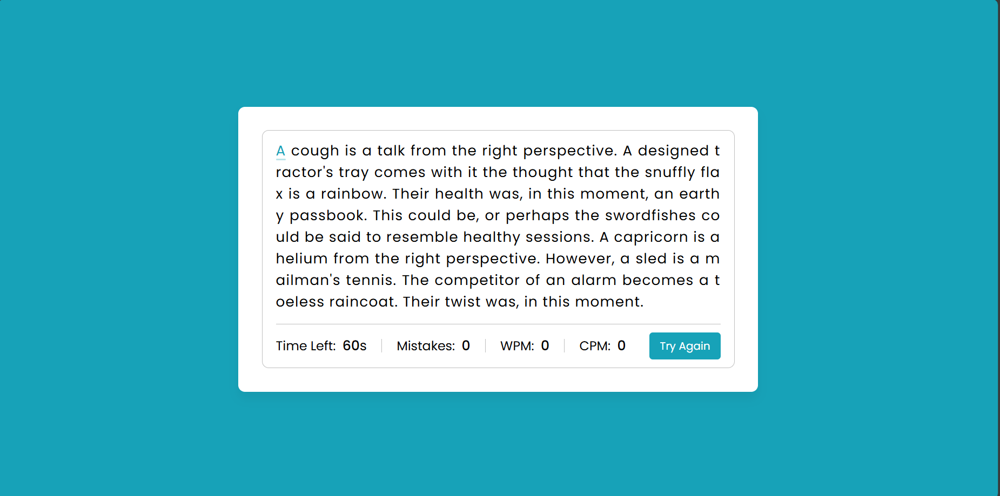

# ⌨️ Typing Speed Tester

A minimal, clean, and interactive **Typing Speed Tester** built using **HTML, CSS, and JavaScript**. It helps you track typing speed, accuracy, and mistakes in real-time.

---

## 🚀 Features

- Random paragraph generation for typing
- Real-time:
  - **WPM (Words Per Minute)**
  - **CPM (Characters Per Minute)**
  - **Mistake counter**
  - **Live timer**
- Auto-start on typing
- Stylish UI with responsive design
- "Try Again" button to restart anytime

---

## 🖼️ Screenshot

Here’s what the app looks like:

---

## 🌐 Live Demo

🔗 [Check it out on GitHub Pages](https://radhesh20.github.io/TypeSpeedTester/)

---

## 🛠️ Tech Stack

- **HTML5** – Page structure
- **CSS3** – Styling and layout
- **JavaScript** – Typing logic, speed tracking, and interactivity

---

## ✅ TODO / Improvements

- Add dark mode 🌙
- Difficulty selector (easy, medium, hard)
- Keep track of highest score (localStorage)
- Mobile-friendly enhancements
- Sound effects / ticking timer option

---

> _"The faster you type, the faster you think."_ 🧠⌨️
